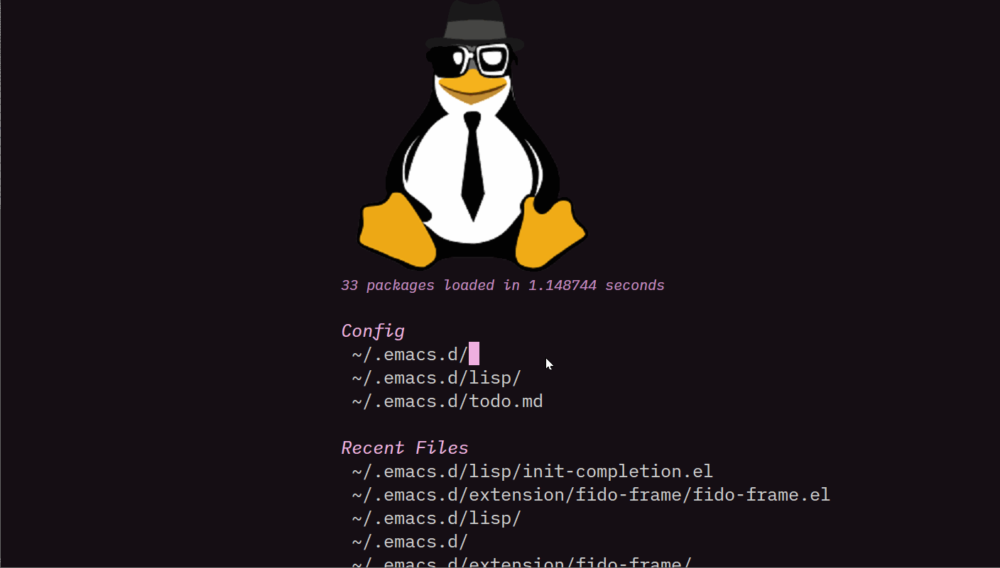

* fido-frame

** What is fido-frame?
fido-frame is an Emacs package that displays the fido minibuffer
completions in a centered child frame, instead of the default
minibuffer area at the bottom of the window.

** Installation
*** Requirements
- Emacs 26.1 or later
- fido-mode (built-in since Emacs 27)

*** Manual Installation
Clone the repository and add to your =load-path=:

#+begin_src shell
  git clone https://github.com/zHaOdANiuu/fido-frame.git
#+end_src

#+begin_src emacs-lisp
  (add-to-list 'load-path "/path/to/fido-frame")
  (require 'fido-frame)
#+end_src

** Usage
#+begin_src emacs-lisp
  (fido-mode 1)           ;; enable fido completions
  (fido-vertical-mode 1)  ;; optional: vertical display
  (fido-frame-mode 1)     ;; enable child frame
#+end_src

** Customization
Customize the child frame appearance with =M-x customize-group RET fido-frame RET=:

| Variable                 | Default | Description                         |
|--------------------------+---------+-------------------------------------|
| =fido-frame-width=         | 0.5     | Width as a fraction of parent frame |
| =fido-frame-left=          | 0.5     | Left offset as a fraction of parent |
| =fido-frame-top=           | 0.3     | Top offset as a fraction of parent  |
| =fido-frame-max-height=    | 10      | Maximum height in lines             |

** Example
Here's fido-frame in action:

#+ATTR_ORG: :width 600

** How It Works
1. =fido-frame-setup= runs on =minibuffer-setup-hook=, creating a child
   frame and moving focus to it.
2. =fido-frame-resize= adjusts the frame height dynamically to fit
   the number of completion candidates.
3. =fido-frame-exit= hides the child frame and restores focus to the
   parent frame on =minibuffer-exit-hook=.
4. The advice on =max-mini-window-lines= tells icomplete to use
   =fido-frame-max-height= for vertical layout calculations.

** Why Use a Child Frame?
- Completions appear centered on screen, reducing eye movement.
- The child frame floats above other windows without disturbing layout.
- Works seamlessly with fido-mode and icomplete.
